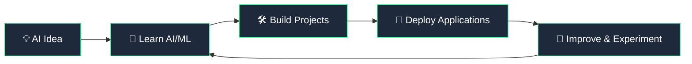
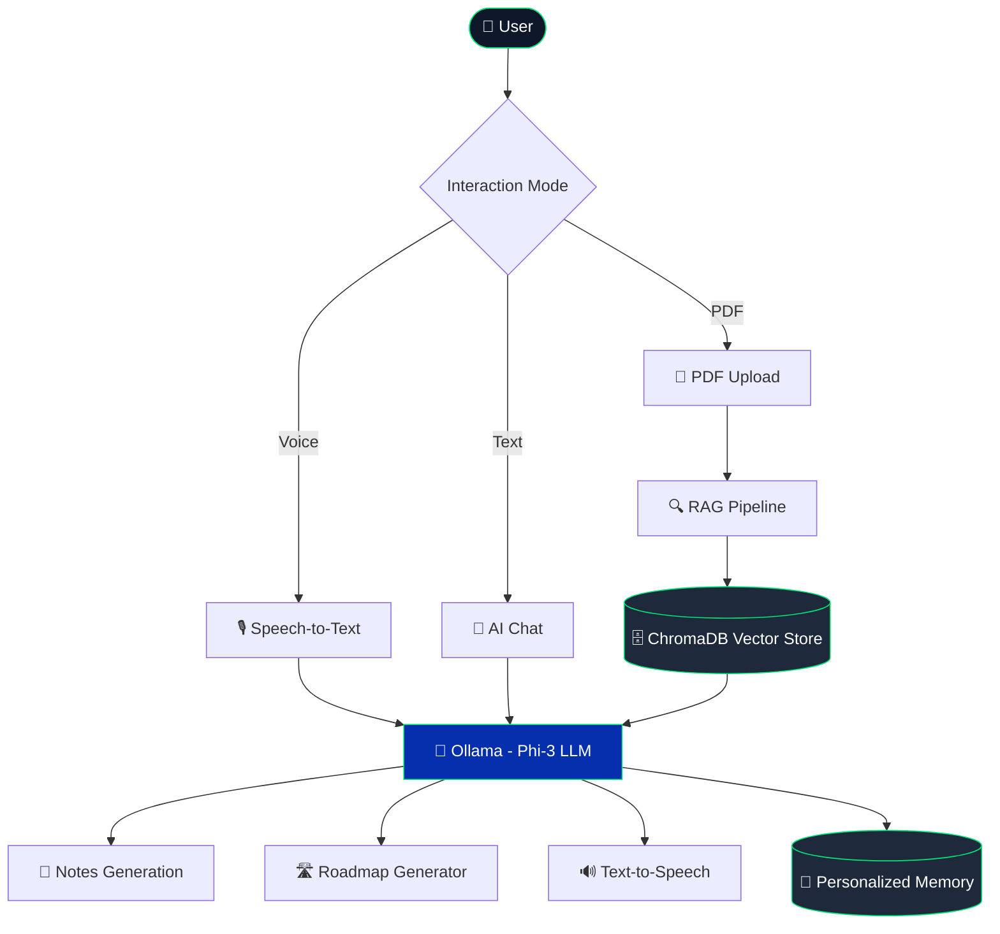

 

---

## 👩‍💻 About Me

I'm **Vibhuti Sharma**, a B.Tech Computer Science & Engineering (Artificial Intelligence) student passionate about building practical, real-world AI systems.

- 🚀 Currently building **APEX AI** — a personal AI-powered study companion with RAG, voice AI, and memory
- 🧠 Exploring **Agentic AI**, **Generative AI**, and **intelligent automation**
- 🏆 **SIH'25 Team Lead**
- ☁️ **AI/ML Team Member** — AWS Student Builder Group
- 🎓 **Former Campus Ambassador** — EDC IIT Delhi
- 💼 IBM SkillsBuild AI Intern • Ex-Microsoft Elevate AI Intern • Ex-ServiceNow Virtual Intern
- 💬 Ask me about **RAG, LLMs, React, FastAPI**, or combining AI models with web apps
- ⚡ Fun fact: I believe the best way to learn AI is by **building, experimenting, and improving**

---

## 🏅 Badges

---

## 🛠️ Tech Stack

**Frontend**

**Backend & Languages**

**AI / ML**

**Databases & Cloud**

**Tools**

---

## 🧠 My AI Journey

---

## 🚀 Featured Project — APEX AI

**APEX AI** is a personal AI-powered learning assistant designed to make studying smarter, faster, and more interactive.

**Key Features:** Personalized Profiles • Intelligent AI Chat • Chat History • PDF Chat (RAG) • Auto Notes Generation • Voice Assistant • Personalized Memory • Roadmap Generator

**Stack:** Python • FastAPI • React.js • Ollama (Phi-3) • ChromaDB

🔗 [View Repository](https://github.com/Vibhu-18/Apex-AI---Personal-assistant-)

---

## 📌 Other Projects

> 🧩 Also building **SkillMatcher Pro.AI** — an AI resume analyzer that matches skills to job requirements.

---

## 📊 GitHub Stats

### 📈 Contribution Graph

---

## 🤝 Connect With Me

*"Let's connect and build the future with AI." 🚀*

