<div align="center">



</div>

---

## 👋 About Me

I'm **Vibhuti Sharma**, a **B.Tech Computer Science & Engineering (Artificial Intelligence) student** passionate about building practical AI systems and intelligent applications.

I enjoy turning AI concepts into real-world projects through **Artificial Intelligence, Machine Learning, Generative AI, NLP, RAG, and AI-powered web applications**.

- 🔭 Currently exploring **Agentic AI and intelligent automation**
- 🤖 Passionate about **AI/ML, Generative AI, NLP, and RAG**
- 🚀 Building practical AI-powered applications
- 🏆 **SIH'25 Team Lead**
- ☁️ **AI/ML Team Member – AWS Student Builder Group**
- 🤝 Former **Campus Ambassador – EDC IIT Delhi**
- 💡 I believe the best way to learn AI is by **building, experimenting, and improving**

---

## 🌐 Connect With Me

<p align="left">

<a href="https://www.linkedin.com/in/vibhuti-sharma2006">

</a>

<a href="https://github.com/Vibhu-18">

</a>

</p>

---

## 🧠 My AI Journey

```mermaid
flowchart LR
    A[💡 AI Ideas] --> B[🧠 Learn AI/ML]
    B --> C[⚙️ Build Projects]
    C --> D[🚀 Deploy Applications]
    D --> E[🔁 Improve & Experiment]
    E --> A

    style A fill:#064e3b,stroke:#4ade80,color:#ffffff
    style B fill:#064e3b,stroke:#4ade80,color:#ffffff
    style C fill:#064e3b,stroke:#4ade80,color:#ffffff
    style D fill:#064e3b,stroke:#4ade80,color:#ffffff
    style E fill:#064e3b,stroke:#4ade80,color:#ffffff
